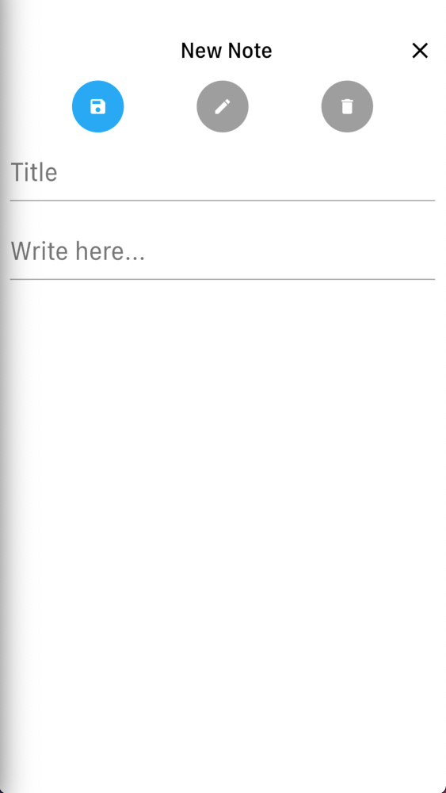

# Meal Note

A project created for UET Mobile Cloud Computing course (INT3122_20).

## Description

This project is the source code of an application that helps you note down things.

## Student Information

Name: Nguyễn Ngọc Anh Vũ

ID: 17012359

## Getting Started

To run this project, follow these steps:

- Clone this project
- Open terminal and navigate to the project's directory
- Make sure that there's at least 1 mobile device or simulator connected to your computer
- Run command `flutter pub get` to install dependencies
- Run command `flutter run`

## Results

- Home Screen

- Create new note

- Edit note

